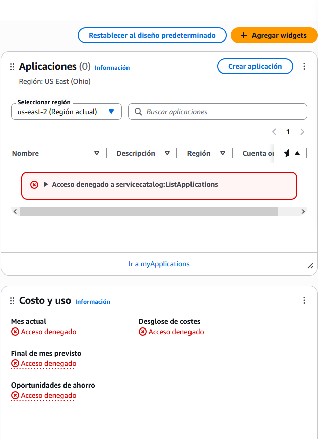

# AWS IAM Custom Policy - S3 ReadOnly User

This project demonstrates the creation of an IAM user with restricted read-only access to S3 buckets.

## What was done:
- Created a custom policy allowing only `GetObject` and `ListBucket`
- Assigned policy to a new IAM user
- Verified access in a separate browser session
- Confirmed only access for read (policy working as expected)

## Skills practiced:
- IAM roles and policies
- AWS security best practices
- Real permission testing using multiple AWS identities
