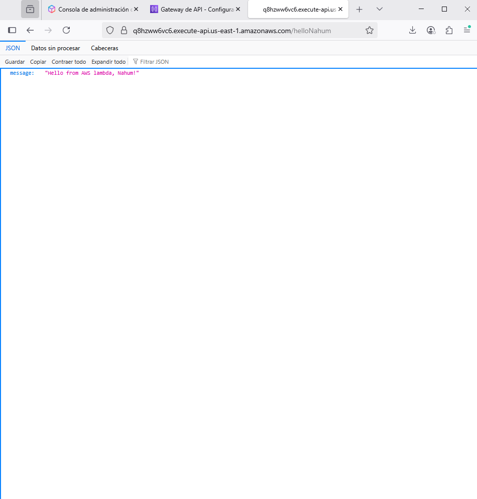

# AWS Lambda + API Gateway: Simple Hello API

This project demonstrates how to create a basic serverless API using AWS Lambda and API Gateway. The API responds with a simple JSON message.

## Features
- Serverless architecture using AWS Lambda
- HTTP API exposed via Amazon API Gateway
- Returns a JSON response with a personalized message
- Uses AWS Free Tier resources

## Setup Instructions

### 1. Create AWS Lambda Function
- Go to AWS Lambda Console
- Create a new function named `helloNahum`
- Runtime: Python 3.12 (or Node.js 20)
- Use "Author from scratch"
- Assign a new role with basic Lambda permissions
- Paste the following code:

```python
def lambda_handler(event, context):
  return {
      'statusCode': 200,
      'body': '{"message": "Hello from AWS Lambda, Nahum!"}',
      'headers': {
            'Content-Type': 'application/json'
      }
  }
```

