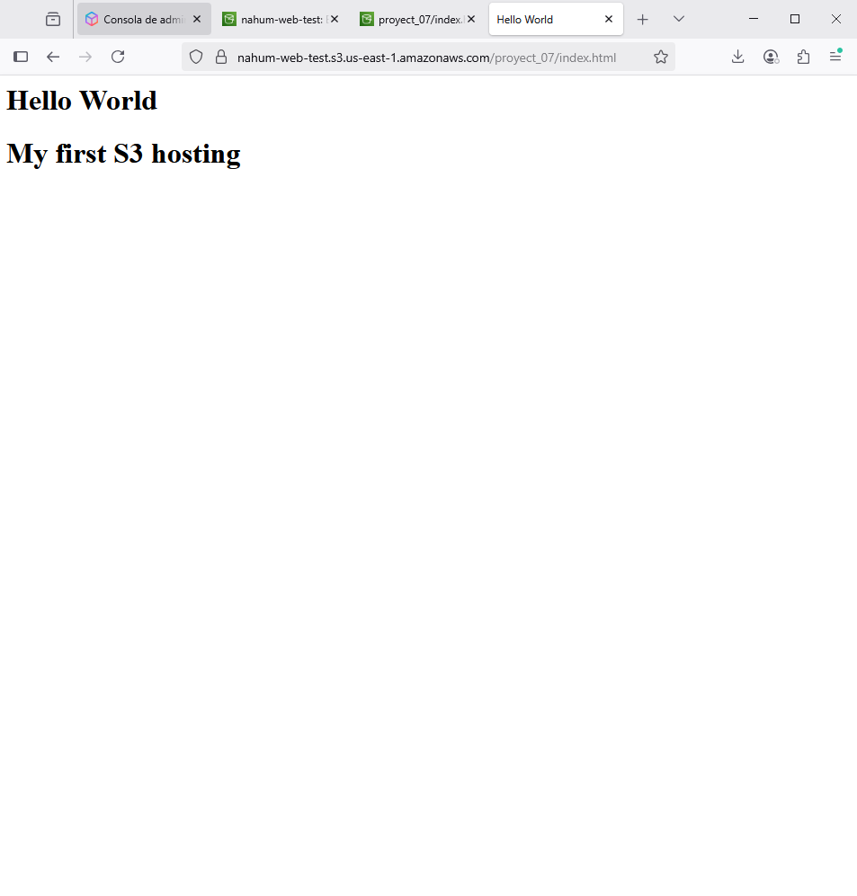

# Static Website Hosting on AWS S3

This project demonstrates how to host a static website using Amazon S3 and AWS Free Tier. It includes the setup of a public S3 bucket uploading of an 'index.html' file, and enabling static website hosting through the AWS Management Console.

## Features
- AWS S3 bucket setup with pubic access
- Static website hosting enabled
- Basic HTML page served from the cloud
- Follows AWS Free Tier limitations

## Technologies
- AWS S3
- HTML5
- Public bucket policies
- Static site endpoint access

## Usage
Open the static website via the public endpoint URL provided by AWS S3 after enabling static hosting.

## Preview
 
