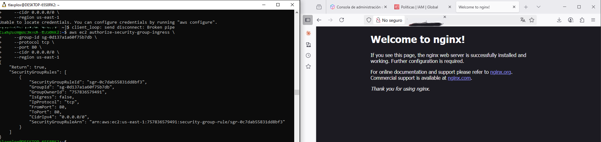
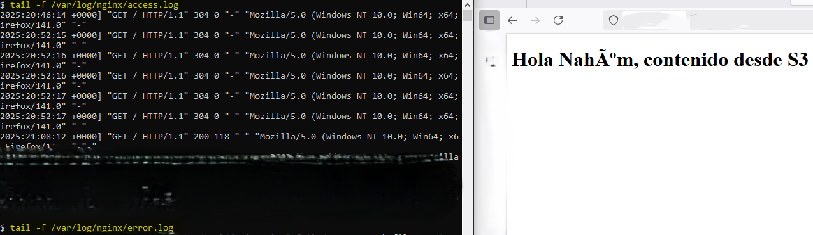

# Project: Hosting a Static Website on Amazon S3 with Access via NGINX on EC2

## Description
This project implements a static website hosted in **Amazon S3**, which is accessed through an **NGINX server** running on an **EC2**.

---

# Steps Performed

### 1. Create `index.html` file and Amazon S3
On the local (EC2) instance:
```bash
mkdir site
cat > site/index.html <<EOF
<h1>Hello from my site in S3</h1>
EOF
```
An S3 bucket was create:
```bash
aws s3api create-bucket --bucket "$BUCKET" --region "$REGION" --create-bucket-configuration LocationConstraint="$REGION"
```
Local files were synchronized:
```bash
aws s3 sync site/ "s3://$BUCKET"
```

File uploaded to EC2 instance:
```bash
scp -i ~/path-to-key/key.pem local-index/index.html user@instance-ip:/path/index/index.html
```

### 2. Allow Public Permissions
To allow public access to the site, policies were assigned to the user:


Set JSON parameters:
```bash
{
	"Version": "2012-10-17",
	"Statement": [
		{
			"Effect": "Allow",
			"Action": [
				"ec2:*",
				"iam:*",
				"ssm:GetParameters",
				"ssm:GetParameter"
			],
			"Resource": "*"
		}
	]
}
```


## 2. Connect to EC2 instance:
```bash
ssh -i ~/path-to-keys/key.pem ec2-user@instance-ip
```


## 3. Start NGINX, Configure and Check Status
Start nginx:
```bash
sudo systemctl start nginx
```
Enable nginx:
```bash
sudo systemctl enable nginx
```
Check status:
```bash
sudo systemctl status nginx
```


## 4. Allow Browser Access
```bash
aws ec2 authorize-security-group-ingress \
```



## 5. Acces Logs in Real-Time
View access logs in real-time:
```bash
tail -f /var/log/nginx/access.log
```
View errors logs in real-time:
```bash
tail -f /var/log/nging/error.log
```

