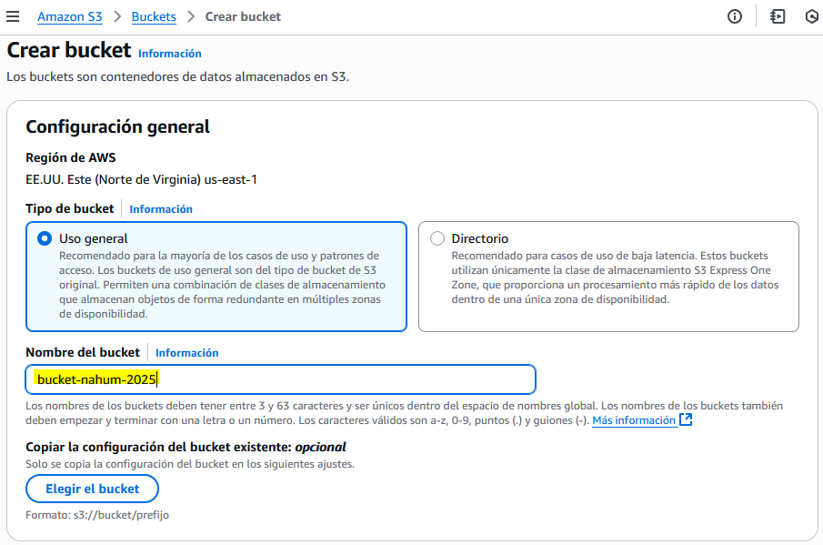
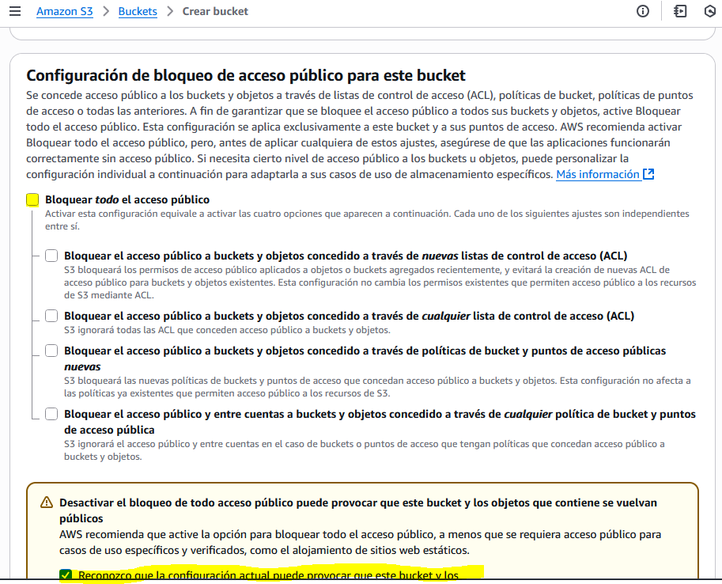
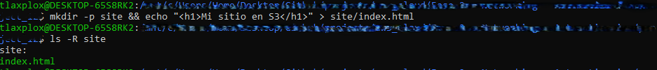
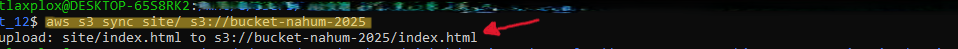
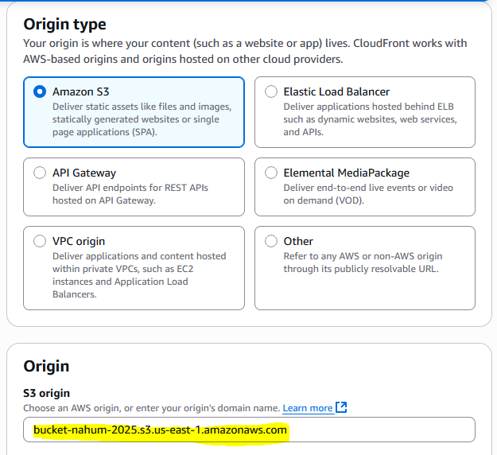
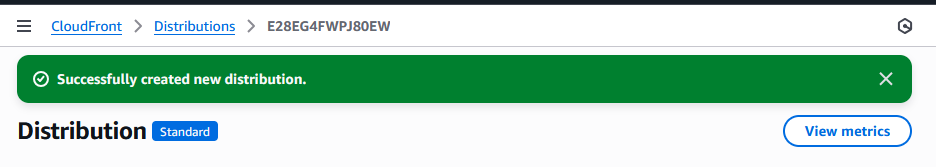
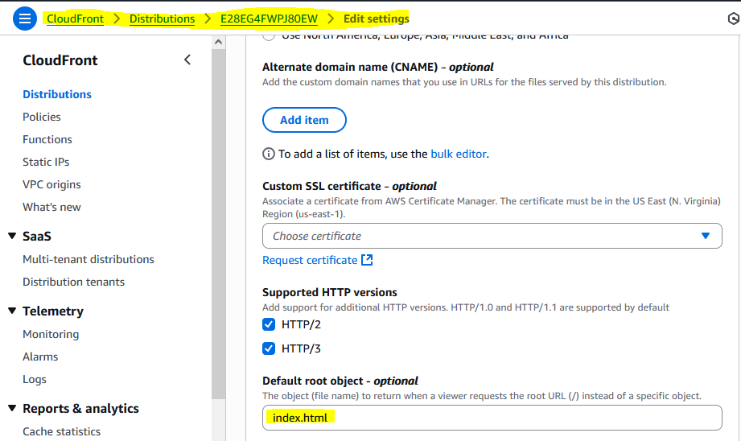
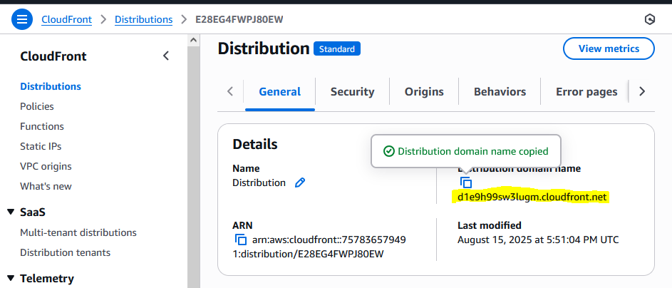
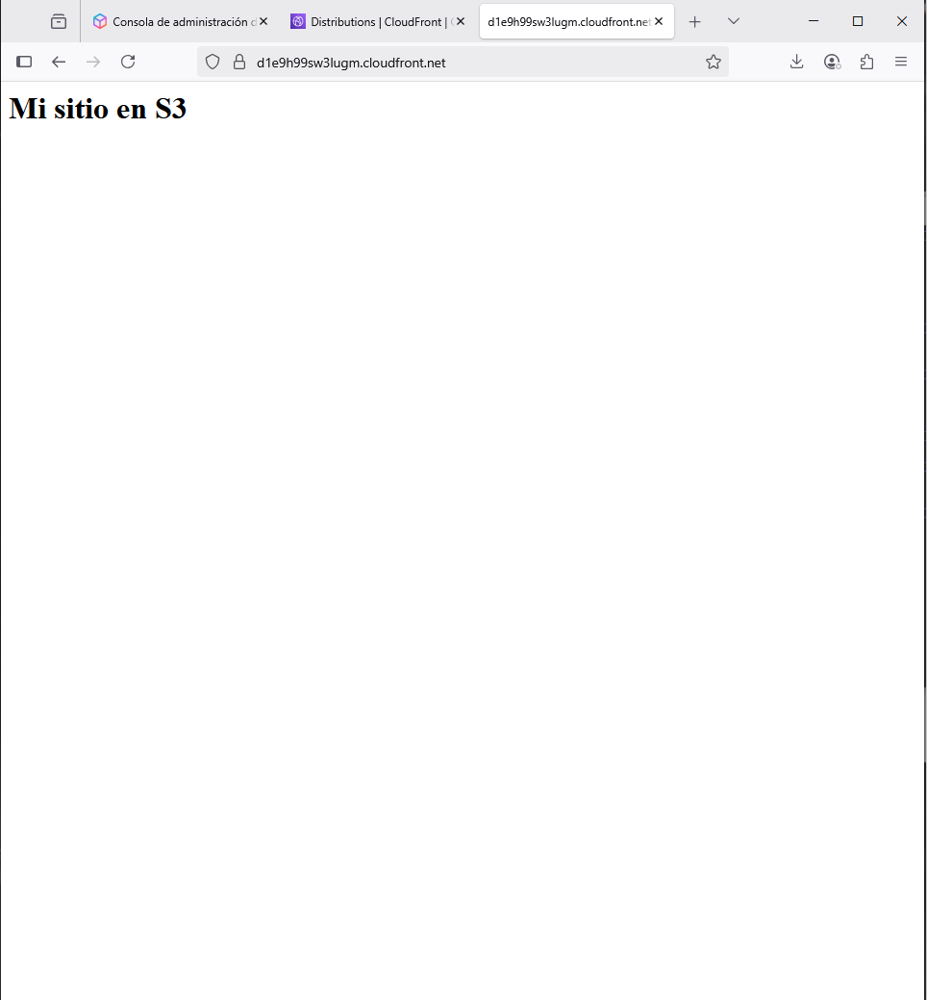

# AWS Practice - Static Site Hosting with S3 and CloudFront

## Objective
Upload an index.html file to an S3 bucket and distribute it through CloudFront, using the Linux terminal on Windows.

## Steps Performed

## 1. Creating the S3 Bucket
- Access the AWS console. 
- Go to S3 and create a new bucket:
    - Globally unique name (bucket-nahum-2025).
    - Allow public access.
    
    
    

---

## 2. Creating and Uploading the index.html File from Local Terminal
- Open the Linux terminal (WSL) on Windows.
- Use AWS CLI to upload the file:

```bash
mkdir -p site && echo "<h1>My S3 Site</h1>" > site/index.html
```
- Confirm folder and file creation
```bash
ls -R site
```
- Upload file to bucket and synchronize (sync)
```bash
aws s3 sync site/ s3://bucket-nahum-2025
```





## 3. CloudFront Configuration
- Go to the CloudFront service in AWS
- Create a new distribution:
    - **Origin:** select the created S3 bucket.
    - **Behavior:** allow public access and enable automatic compression.
    - **Configuration:** leave default values.
- Wait for the distribution status to be **Deployed.**







---

## 4. Site Testing
- Copy the CloudFront **Domain Name**.
- Access from the browser



