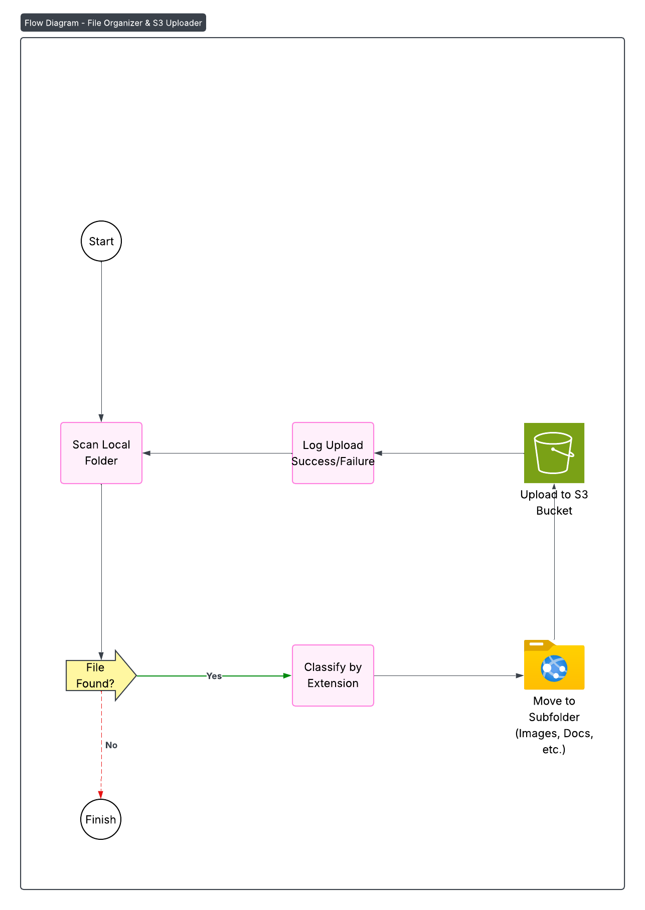

## **File Organizer and Uploader to S3**

This project is a **Python utility** that organizes local files into folders by type, and uploads them to an **Amazon S3 bucket** for storage.

---

## **Features**
- Automatically organizes files by extension.
- Creates folders for:
    - **Images**: `.jpg`, `.png`, `.gif`
    - **Documents**: `.pdf`, `.docx`, `.txt`
    - **Videos**: `.mp4`, `.avi`, `.mov`
    - **Others**: Any file type not listed above
- Uploads the organized files to a specified **AWS S3 bucket**.
- Uses **Boto3** fo AWS integration.

---

## **Requirements**
- Python 3.8+
- AWS Account
- An existing S3 bucket with his respective policies: [S3 Policies](images/5.png)
- AWS credentials configured with `aws configure` or environment variables.

---

## **Installation**
1. Clone or download this repository.
2. Install dependencies:

    ```bash
    pip install boto3
    ```
    [Boto3 Installation](images/1.png)
3. Configure you AWS CLI or environment with IAM credentials.

## **Usage**
1. Place the script in the folder where you want to organize files.
2. Run the script:

    ```bash
    python file_organizer.py
    ```
3. Input:
    - The **directory path** to organize.
    - The S3 bucket name for upload.

## **Example**
[Command Execution](images/6.png)

    ```bash
    Enter the folder path: ./downloads
    Enter the S3 bucket name: my-backup-bucket
    ```

- Files in **./downloads** are moved into subfolder: [Subfolder](images/7.png)
    - images/
    - documents/
    - videos/
    - others/

- Then they are uploaded to **s3://my-backup-bucket/**

    [Docs](images/8.png)
    [Images](images/9.png)
    [Others](images/10.png)

## **Diagram of this project:**


