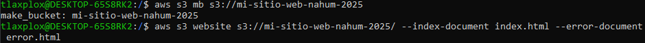
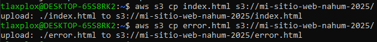
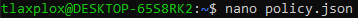
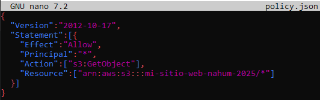
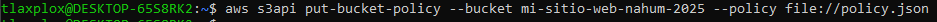
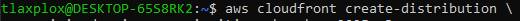
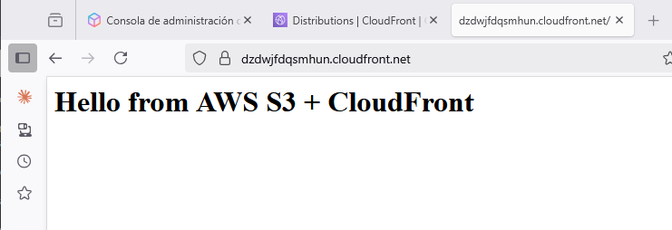

# Project: Static Web in AWS S3 with CloudFront and HTTPS

## Objective
Deploy a **static website** on AWS using **S3**, distribute it globally with **CloudFront**, and secure the connection with **HTTPS**, **without needing a paid domain**.
This project belongs to **Phase 3 - Integration and Portafolio** of my AWS roadmap

---

## Technologies and Servicies Used
- **AWS S3** -> Hosting of static website.
- **AWS CloudFront** -> Global content distribution.
- **AWS CLI** -> Deployment automation.

> **Note:** The project uses the **free CloudFront URL**, which includes an SSL certificate managed by AWS, avoiding domain costs.

---

## Project Steps

### 1. Create an S3 Bucket
```bash
aws s3 mb s3://my-static-site-nahum-2025
aws s3 website s3://my-static-site-nahum-2025/ --index-document index.html --error-document error.html
```


### 2. Upload Files
```bash
echo "<h1>Hello from AWS S3 + CloudFront</h1>" > index.html
echo "<h1>Error 404 - Page Not Found</h1>" > error.html

aws s3 cp index.html s3://my-static-site-nahum-2025/
aws s3 cp error.html s3://my-static-site-nahum-2025/
```


### 3. Configure Minimal Public Permissions
Create policy.json:
```bash
nano policy.json
```


```bash
{
  "Version":"2012-10-17",
  "Statement":[{
    "Effect":"Allow",
    "Principal":"*",
    "Action":["s3:GetObject"],
    "Resource":["arn:aws:s3:::my-static-site-nahum-2025/*"]
  }]
}
```


Apply the policy:
```bash
aws s3api put-bucket-policy --bucket my-static-site-nahum-2025 --policy file://policy.json
```



### 4. Create CloudFront distribution
```bash
aws cloudfront create-distribution \
    --origin-domain-name my-static-site-nahum-2025.s3.amazonaws.com
```


### 5. Access the secure website
1. Copy the CloudFront URL.
2. Open it in a browser using https://.
3. You should see **index.html** loading via HTTPS with the green padlock.
    **No paid domain is required.**
    **CloudFront may take 10-15 minutes to propagate and enable HTTPS.**



>**Note:** This is the **first complete project of Phase 3**, demonstrating skills in **hosting, networking, and security on AWS** without additional costs.