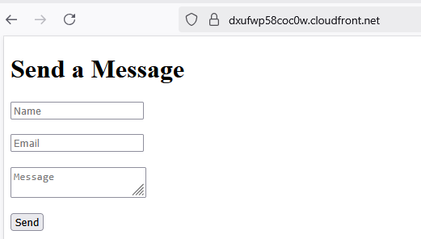
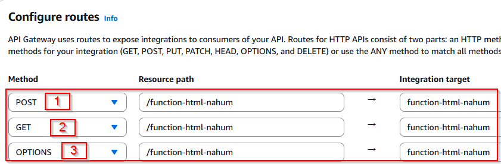
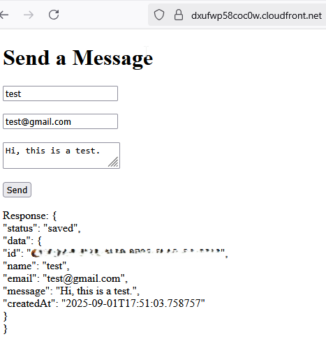

# S3 Static Page with Lambda API and DynamoDB

## What this project demonstrates
This project demonstrates how to build a serverless web application using AWS. It hosts a static HTML page on **Amazon S3**, serves it securely with **CloudFront**, and connects the form on the page to a **DynamoDB** table through an **AWS Lambda** function exposed via **API Gateway**.


## Goal
The goal is to show how multiples AWS services can work together to create a simple, scalable, and cost-effective serverless architecture

## Steps to successfully Complete the Project:

### 1. Prepare HTML Page
- Create `index.html` with form (name, email, message).
- Use JavaScript `fetch()` to POST data to the API Gateway route.
- Make sure `fetch()` uses a new API URL.

### 2. Upload HTML to S3
- Upload your `index.html` to your S3 bucket.
- Enable **static website hosting**.

### 3. Create CloudFront Certificate
- Create a `CloudFront Certificate` to put in S3 bucket.

    

- Select Amazon S3 for Origin type.

    

- Choose the S3 bucket that contains the HTML page as the origin.

    

- Verify that the CloudFront URL works.

    

### 4. Create DynamoDB Table
- Name: `table-html-name`
- Primary key: `key` (string)

    

### 5. Create Lambda Function
- Create a Lambda Function (`function-html-nahum`).

    

- Connect it to the DynamoDB table (`table-html-nahum`).

    

- Include **CORS headers** in the Lambda response.

    

```
"Access-Control-Allow-Origin": "*"
```

- Handle **OPTIONS preflight requests.**
- Ensure Lambda role has permission to `dynamodb:PutItem` on your table.

    

### 6. Create an API Gateway
- Create an HTTP (or REST API).

    

- Integrate the route with your Lambda function.

    

- Create a **POST route**: 
    `/api-html-nahum`

    

- Deploy the API.
- Configure the CORS.

    

- Add origins `*` and Methods `Get` `POST` `OPTIONS`

    

- Copy the **Invoke URL for the route**

    

### 7. Update HTML page

- Update your HTML to include the API Invocation URL, followed by the Lambda function name as the endpoint.

    

```
const res = await fetch('https://4320pdkk12.execute-api.us-east-1.amazonaws.com/function-html-nahum'
```

### 8. Send the message

- Fill in the fields and then press send.

    
    
- Verify if the messaged is stored correctly in `DynamoDB`.

    

## Troubleshooting

- **Message not receive:**
    If you configure the wrong API Gateway URL in your HTML `fetch()` call, the request will fail and the message will never reach DynamoDB. Always verify that you are using the correct *Invoke URL* from API Gateway

-  **CloudFront caching issues:**
    When using a `CloudFront` distribution, you may encounter problems with old versions of your files being served from the cache. To resolve this, either invalidate the cache or makes sure to reference `/index.html` explicitly in the URL

    [Message not receive solution](images/error.PNG)

## Conclusion
By completing this project, we successfully connected a static web page to DynamoDb table using a Lambda-powered API Gateway. This demonstrates how AWS services can integrate to build serverless applications without managing servers.

### Possible Improvements
- Add **input validation** to the Lambda function.
- Store data with additional attributes like timestamps.
- Enable **authentication** with Amazon Cognito.
- Automate deployment with **AWS SAM** or **Terraform**. 