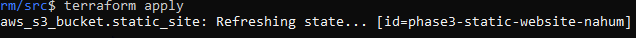
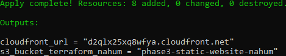
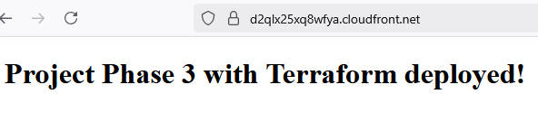

# Architecture optimization using Terraform
## Objective
Optimize an AWS architecture using Terraform to achieve an infrastructure that is **scalable, secure, and automated**.
 It applies **automation, modularization, and cost-control** practices.
 ## Implemented Architecture
 - **Amazon S3** -> Static website hosting bucket
 - **CloudFront** -> Content delivery with HTTPS
 - **IAM** -> Roles and policies with least privilege
 - **Terraform Remote State** -> Collaborative state management
 - Cleanup steps to avoid unnecessary costs
## Tools & Technologies 
- [Terraform](https://www.terraform.io)
- [AWS CLI](https://aws.amazon.com/cli/)
- **AWS Provider** for Terraform
## Deployment
### 1. Initialize Terraform
```
terraform init
```
### 2. Preview changes
```
terraform plan
```
### 3. Apply infrastructure
```
terraform apply -auto-approve
```


Expected output:



### 4. Verify page S3 + Cloudfront
```
terraform output cloudfront_url
```
Expected output (paste in the browser):
```
https://example.cloudfront.net/index.html
```

### 5. Destroy resources (to prevent extra costs)
```
terraform destroy -auto-approve
```
### 6. Remove local Terraform cache
```
rm -rf .terraform
rm -f terraform.tfstate terraform.tfstate.backup
```
## Cleaning Versioned Buckets
If you encounter the error `BucketNotEmpty`, remove all versions and delete   markers before destroying:
```
aws s3api list-object-versions --bucket <bucket-name> \
    --query `{Objects: Versions[].{Key:Key,VersionId:VersionId}, DeleteMarkers[].{Key:Key,VersionId:VersionId}}` \
    --output json > objects.json

aws s3api delete-objects --bucket <bucket-name> --delete file://objects.json
```
## Results
- Static website accessible via **CloudFront + HTTPS.**
- Infrastructure reproducible in **any AWS region.**
- Controlled costs through **automated cleanup**
## Lessons Learned 
- Managing versioned infrastructure with Terraform.
- How to handle **S3 versioning cleanup errors.**